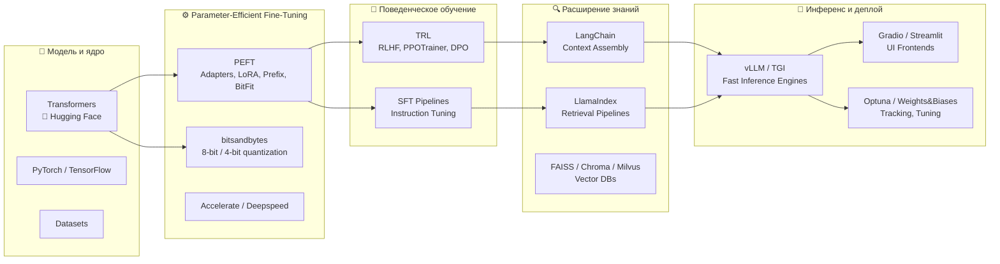

# 🧠 LLM about LLM — Fine-Tuning Atlas

_Полная карта методов адаптации нейросетей — от классического Fine-Tuning до современных PEFT, LoRA, QLoRA и RAG._

> Цель: дать инженеру системное понимание всех существующих подходов дообучения моделей — когда, зачем и какой метод выбрать под задачу, ресурсы и данные.

---

## 📍 1. Эволюция подходов

```
Full Fine-Tuning
     ↓
Partial / Head-only Tuning
     ↓
Parameter-Efficient Fine-Tuning (PEFT)
     ├─ LoRA / QLoRA
     ├─ Adapters
     ├─ Prefix / Prompt / P-Tuning
     ├─ BitFit
     ↓
High-Level Tuning
     ├─ SFT (Supervised Fine-Tuning)
     ├─ RLHF (Reinforcement Learning from Human Feedback)
     ↓
Non-Training Adaptation
     ├─ RAG (Retrieval-Augmented Generation)
     ├─ In-Context Learning / Prompt Engineering
```

---

## 🧩 1.1. Диаграмма эволюции методов (Mermaid)

```mermaid
graph TD
    A[Full Fine-Tuning<br/>🔧 Обучаются все веса] --> B[Partial / Head-only<br/>💡 Верхние слои]
    B --> C[Parameter-Efficient Fine-Tuning (PEFT)]
    C --> D1[LoRA / QLoRA<br/>⚡ Low-Rank адаптация]
    C --> D2[Adapters<br/>🧱 Встраиваемые блоки]
    C --> D3[Prefix / Prompt / P-Tuning<br/>🎯 Обучаемые токены]
    C --> D4[BitFit<br/>🪶 Только bias]
    D1 --> E1[SFT<br/>📘 Supervised Instruction]
    D2 --> E1
    D3 --> E1
    D4 --> E1
    E1 --> E2[RLHF<br/>🧠 Human Feedback Reinforcement]
    E2 --> F1[RAG<br/>🔍 Retrieval-Augmented Generation]
    E2 --> F2[In-Context / Prompt Engineering<br/>💬 Без обучения]
    F1 --> G[Hybrid Systems<br/>🧩 PEFT + RAG + RLHF]
```

---

## ⚙️ 2. Классификация методов

| Категория | Суть | Область применения | Пример инструмента |
|------------|------|--------------------|--------------------|
| **Full Fine-Tuning** | Обучаются все параметры модели | Новая предметная область, большие данные | 🤗 Transformers |
| **Partial Fine-Tuning** | Обучаются верхние слои / классификатор | Подстройка под похожие задачи | PyTorch, HF Trainer |
| **Adapter Tuning** | Вставка небольших обучаемых блоков между слоями | Мультизадачные системы | PEFT, AdapterHub |
| **LoRA / QLoRA** | Обучаются low-rank матрицы в attention-слоях | Эффективный PEFT для LLM | PEFT + bitsandbytes |
| **BitFit** | Обучаются только bias-параметры | Минимальные ресурсы | PEFT |
| **Prefix / Prompt / P-Tuning** | Обучаемые embedding-префиксы вместо изменения весов | Задачи генерации, QA | PEFT |
| **SFT / Instruction Tuning** | Дообучение на примерах “вопрос–ответ” | Инструкционные LLM (ChatGPT-стиль) | TRL, PEFT |
| **RLHF** | Обучение через обратную связь человека | ChatGPT, Claude, Gemini | TRL (PPOTrainer) |
| **RAG** | Без обучения: добавление retrieval-контекста | Q&A, корпоративные ассистенты | LangChain, LlamaIndex |
| **In-Context / Prompt Engineering** | Использование примеров прямо в prompt’e | Быстрая адаптация без обучения | OpenAI API, vLLM |

---

## 🧭 4.1. Интеллект-карта выбора метода

```mermaid
flowchart TD
    A[🚀 Начало: требуется адаптировать модель] --> B{Есть мощная GPU<br/>и достаточно данных?}
    B -- Да --> C[🔧 Full Fine-Tuning<br/>Обучаем все параметры]
    B -- Нет --> D{Хотите дообучить только часть модели?}
    D -- Да --> E[⚙️ Partial Fine-Tuning<br/>Обучаем верхние слои / классификатор]
    D -- Нет --> F{Нужно адаптировать под новую задачу<br/>при ограниченных ресурсах?}
    F -- Да --> G[💡 PEFT-подходы<br/>(LoRA, QLoRA, Adapters, Prefix)]
    F -- Нет --> H{Хотите дообучить только смещения (bias)?}
    H -- Да --> I[🪶 BitFit<br/>минимальный апдейт весов]
    H -- Нет --> J{Нужен ассистент / диалоговая модель?}
    J -- Да --> K[🗣️ SFT / RLHF<br/>обучение на инструкциях и обратной связи]
    J -- Нет --> L{Нужно актуализировать знания<br/>без обучения модели?}
    L -- Да --> M[🔍 RAG (Retrieval-Augmented Generation)<br/>векторный поиск + контекст]
    L -- Нет --> N[💬 In-Context Learning / Prompt Engineering<br/>адаптация без fine-tuning]
    M --> O[🏁 Гибридные решения<br/>RAG + LoRA / RLHF]
    K --> O
    G --> O
```

---

## 🧰 6. Fine-Tuning Stack — архитектура инструментов



---

## 🏁 9. Заключение — *LLM about LLM*

> Ты не просто обучаешь модели —  
> ты учишь их **учиться**.  
>  
> Каждая эпоха fine-tuning делает шаг от “механического подбора весов”  
> к **пониманию контекста, целей и смысла**.  
>  
> От полного переобучения — к параметрической экономии.  
> От статичных моделей — к системам, которые вспоминают, адаптируются и рассуждают.  
>  
> **Full Fine-Tuning** — это сила.  
> **LoRA и QLoRA** — это эффективность.  
> **RLHF** — это эмпатия.  
> **RAG** — это память.  
>  
> А их объединение — это не просто AI,  
> это **искусство обучения самого обучения**.  
>  
> 🧠 *LLM about LLM* — это не документация.  
> Это дорожная карта мышления инженера,  
> который создает интеллект, а не просто код.
